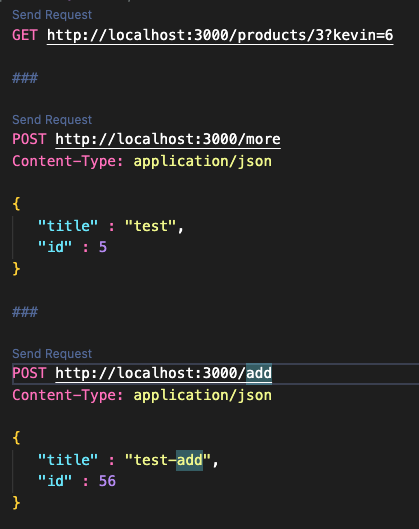

# Vue3-Analysis-Express

## <mark style="color:blue;">Introduction -- Modified Undo Changes 2</mark>

This is a functional demonstration of Express and VSCode RestClient Extension.

Express is a Nodejs application that allows a developer to create a locally running host.

The host will respond to HTTP requests: GET, PUT, POST, DELETE

RestClient Extension allows a developer to compose and execute HTTP requests.

The combination of Express and RestClient allow a developer to design, develop and test HTTP commands w/o any traditional backend.

## <mark style="color:blue;">Setup</mark>

To get this project to function, TWO things are required:

Express

VSCode RestClient Extension.

#### <mark style="color:blue;">Express</mark>

Express is already defined in the package.json.

To install from the package.json, enter this in a terminal:

`$ node init`

This will read the package.json and install all of the required packages in the node\_modules folder.

If Node Express has NOT been installed, enter this in a terminal:

`$ npm install express`

#### <mark style="color:blue;">VSCode RestClient Extension</mark>

This is a VSCode extension that is available for download in the VSCode Marketplace.

#### Running the Application

## <mark style="color:blue;">Start Express</mark>

To start Express enter this in Terminal:

`$ npm start`

<mark style="background-color:yellow;">**OBSERVE**</mark>

`vue3-analysis-express-v1@1.0.0 start`

`node index.js`

`"Listening on port: 3000"`

<mark style="color:yellow;">Run HTTP Requests</mark>

To test the existing HTTP requests, open the http.rest file.

After Express is running, you will see “Send Request” links above the example HTTP requests.

Select one of the links and the request will be sent.

<mark style="color:red;">Note</mark>

Sometimes the links are visible but will not function. Moving from one page to another sometimes recovers the functionality. Stopping and Starting Express sometimes works.

## <mark style="color:blue;">Example - GET</mark>

`GET` [`http://localhost:3000/products/3?kevin=6`](http://localhost:3000/products/3?kevin=6)

#### <mark style="color:blue;">VSCode Tab Output</mark>

`HTTP/1.1 200 OK`

`X-Powered-By: Express`

`Content-Type: application/json; charset=utf-8`

`Content-Length: 22`

`ETag: W/"16-CtQt77GINx9Tqa9fkaAcPSvmRJE"`

`Date: Mon, 01 Apr 2024 14:42:24 GMT`

`Connection: close`

`{`

`"id": 3,`

`"name": "Shoe"`

`}`

<mark style="color:blue;">Terminal</mark>

`{ kevin: '6' }`

`{ id: '3' }`

## <mark style="color:blue;">Example - GET</mark>

#### <mark style="color:red;">Note</mark>

The only difference between this example and the next example is the PATH. This demostrates using multiple paths can generate dofferent results.\
\
`GET` [`http://localhost:3000/products/3?kevin=6`](http://localhost:3000/products/3?kevin=6)

`POST http://localhost:3000/more`

`Content-Type: application/json`

`{`

`"title" : "test",`

`"id" : 5`

`}`

#### <mark style="color:blue;">VSCode Tab Output</mark>

`HTTP/1.1 200 OK`

`X-Powered-By: Express`

`Content-Type: text/plain; charset=utf-8`

`Content-Length: 2`

`ETag: W/"2-nOO9QiTIwXgNtWtBJezz8kv3SLc"`

`Date: Mon, 01 Apr 2024 14:47:03 GMT`

`Connection: close`

`OK`

#### <mark style="color:blue;">Terminal</mark>

`5`

`test`

## <mark style="color:blue;">Example - POST</mark>

`POST http://localhost:3000/more`

`Content-Type: application/json`

`{`

`"title" : "test",`

`"id" : 5`

`}`

#### <mark style="color:blue;">VSCode Tab Output</mark>

`HTTP/1.1 200 OK`

`X-Powered-By: Express`

`Content-Type: text/plain; charset=utf-8`

`Content-Length: 2`

`ETag: W/"2-nOO9QiTIwXgNtWtBJezz8kv3SLc"`

`Date: Mon, 01 Apr 2024 14:48:43 GMT`

`Connection: close`

`OK`

<mark style="color:blue;">Terminal</mark>

`56`

`test-add`

<figure><figcaption><p>Sample code</p></figcaption></figure>


````javascript
``` https://app.gitbook.com/o/fEd0zt5Oz5fKKTP5IxSP/snippet/11508javascript
import Express from "express"
import Products from "./products.js"

const app = Express()
const port = 3000

app.use(Express.json())
app.use(Express.urlencoded({ extended: true }))

function mid(request, response, next){
	console.log(request.query)
	console.log(request.params)
	next()
}

//		 GET, PUT, POST, DELETE
//				GET == Fetch Information from Target
//				PUT == Change Information in Target
//				POST == Add Information to Target
//				DELETE == Delete Information in Target

// 		app.get()
// 		app.post()
// 		app.delete
// 		app.put()

//			Arg1 -- Path
//			Arg2 -- Middle ware (skip) or Callback if only 2x args
//			Arg3 -- Callback
//			request == Input
//			response == Output
app.get("/products/:id", mid, (request, response) => {
	response.json(Products.find((product)=> {
		//			request.params is a string.
		//			Add '+' in from will convert the string value to a number
		return +request.params.id === product.id	}))

} )

app.post("/more", ( request, response ) => {
	response.sendStatus( 200 )
	console.log(request.body.id)
	console.log(request.body.title)
})

app.post("/add", ( request, response ) => {
	response.sendStatus( 200 )
	console.log(request.body.id)
	console.log(request.body.title)
})

app.listen(port, () => console.log(`"Listening on port: ${port}"`) )
```
````



[index.js Example](https://app.gitbook.com/o/fEd0zt5Oz5fKKTP5IxSP/snippet/11505)

